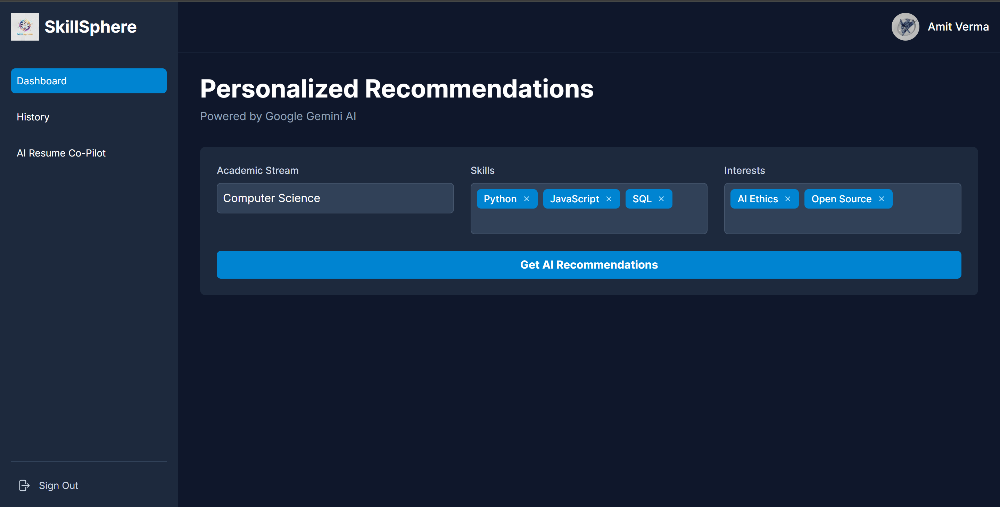
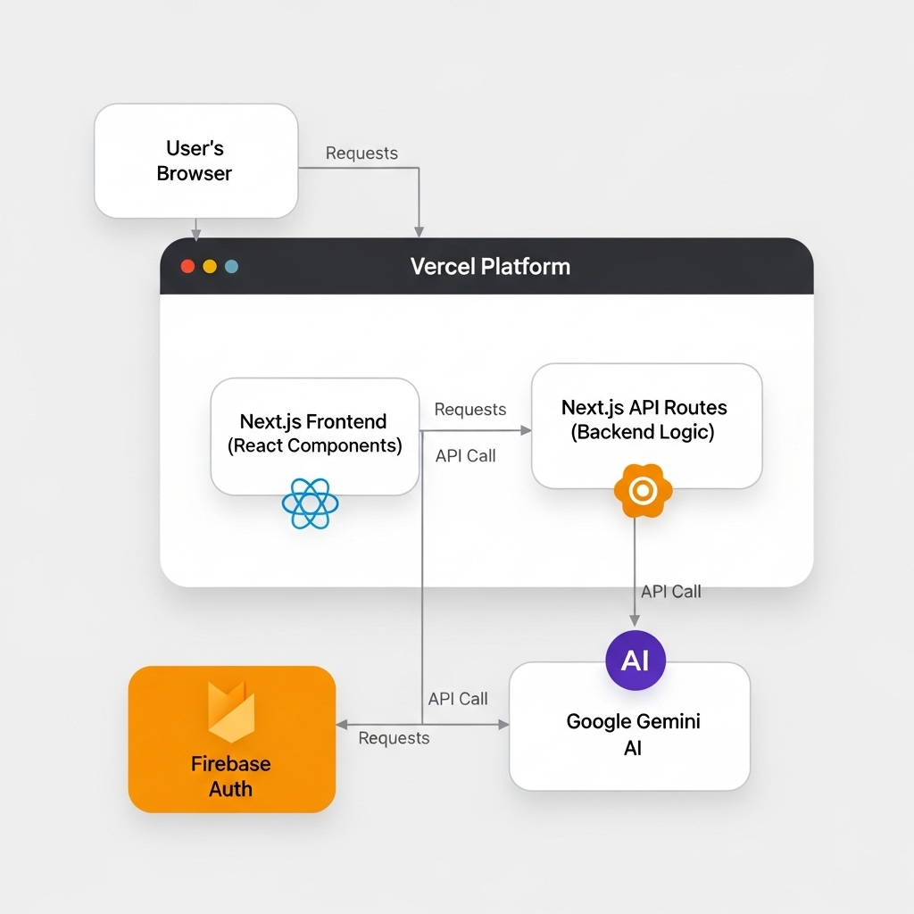

# 🚀 SkillSphere: AI-Powered Skill & Career Advisor  

[](https://skill-sphere-7szf.vercel.app/)
[](https://nextjs.org/)
[](https://ai.google.dev/)
[](https://tailwindcss.com/)
[](https://www.typescriptlang.org/)


👉 **Live Demo:** [SkillSphere Web App](https://skill-sphere-7szf.vercel.app)  

---

## 🎯 Why SkillSphere?  
Confused about your career path? Overwhelmed by too many choices?  
**SkillSphere** uses Google’s **Gemini AI** to turn your academic background, existing skills, and personal interests into **personalized career roadmaps**. No more guesswork — get **AI-powered guidance** that actually makes sense.  

---
## ✨ Key Features  

- 🤖 **AI-Powered Career Recommendations**  
  Generates 3 tailored career paths using Google Gemini 1.5 Flash, based on a user’s academic stream, skills, and interests. Displayed in a clean, card-based UI.  

- ⚖️ **Interactive Career Comparison**  
  Select any two careers and get a side-by-side AI-generated comparison table.  

- 📝 **AI Resume Co-Pilot**  
  Paste a job description, and get customized, powerful resume bullet points based on your skills.  

- 🔐 **Secure User Authentication**  
  Sign in safely with Google accounts via Firebase Authentication.  

- 📱 **Fully Responsive UI**  
  Seamless experience across desktop and mobile devices with Tailwind CSS. 
---

## 🖼️ Screenshot 
 

---

## 🛠️ Tech Stack

| Category         | Technology |
|------------------|------------|
| **Framework**    | Next.js (App Router) |
| **Language**     | TypeScript |
| **Styling**      | Tailwind CSS |
| **Auth**         | Firebase Authentication |
| **Backend**      | Next.js API Routes (Serverless Functions on Vercel) |
| **AI Model**     | Google Gemini 1.5 Flash |
| **Deployment**   | Vercel |


---

## 🏗️ System Architecture  
  
The application follows a modern, unified architecture where the frontend and backend are part of a single Next.js project deployed on Vercel. This approach simplifies development and ensures scalability.

<p align="center">
  
</p>


**Data Flow:**
1.  The user interacts with the **Next.js Frontend** (React Components) in their browser.
2.  User actions (like requesting recommendations) trigger an API call to a **Next.js API Route**.
3.  This API Route (the **Backend Logic**) securely calls the **Google Gemini AI** with a structured prompt.
4.  The AI's response is **streamed** back through the API route directly to the user's browser for a real-time experience.
5.  **Firebase Authentication** handles all user sign-in and session management.

---

## 📂 Project Structure  

## SkillSphere/├── backend/           # Node.js backend service

SkillSphere: AI-Powered Skill & Career Advisor
SkillSphere is a modern, full-stack web application designed to provide personalized career and skill recommendations. Leveraging the power of Google's Gemini AI, this application offers tailored advice to help guide users on their professional journey.

The application is fully deployed to the cloud, featuring a responsive user interface, user authentication, and a persistent history of recommendations.

Live Application URL: https://skill-sphere-7szf.vercel.app/


## 🚀 Future Scope  

SkillSphere has huge potential to evolve into a **full-fledged career development platform**. Planned enhancements include:  

- 🌐 **Actionable Job & Learning Links**  
  Direct users to relevant job openings or top-rated courses based on their eligibility and skill gaps.  

- 🧩 **AI-Powered Skill Assessment Quizzes**  
  Personalized quizzes to assess skill proficiency and identify knowledge gaps.  

- 📄 **AI Resume Enhancement**  
  Upload full resumes for a comprehensive AI-driven analysis with actionable suggestions for projects and skill upgrades.  

- 🛠️ **AI Project Generator**  
  Generate bespoke portfolio projects aligned with user skills and target careers.  

- 🎤 **AI-Powered Interview Prep**  
  Generate common interview questions for recommended careers with AI-driven feedback on responses.  

- 💬 **Personalized Chatbot**  
  Ask conversational questions about careers, skills, or the job market.  

- 📚 **Hyper-Localized Learning Paths**  
  Integrate Indian educational resources (like NPTEL) and tutorials in regional languages for tailored learning.  


## 📁 Project Structure

The project is structured as a unified full-stack Next.js application. The `frontend` directory contains the entire codebase.

```
SkillSphere/
└── frontend/                  <-- Root of the Vercel Project
    ├── public/                <-- Static assets (images, fonts)
    ├── src/
    │   ├── app/               <-- Core application (UI Pages & Backend API)
    │   │   ├── api/           <-- BACKEND: All server-side API routes
    │   │   │   ├── compare-careers/
    │   │   │   ├── generate-recommendations/
    │   │   │   └── resume-helper/
    │   │   │
    │   │   ├── resume-helper/ <-- FRONTEND: The UI for the Resume Co-Pilot page
    │   │   │   └── page.tsx
    │   │   │
    │   │   ├── layout.tsx     <-- Main application layout
    │   │   └── page.tsx       <-- Main dashboard page UI
    │   │
    │   ├── components/        <-- Reusable React components (Cards, Inputs, etc.)
    │   ├── context/           <-- Global state management (Authentication)
    │   ├── lib/               <-- Helper libraries (Firebase client)
    │   └── types/             <-- Shared TypeScript type definitions
    │
    ├── next.config.ts         <-- Next.js configuration
    └── package.json           <-- Project dependencies
```


## 🚀 Getting Started Locally

Follow these instructions to set up and run the project on your local machine.

---

### Prerequisites
- Node.js (v18 or later)
- A Google Account to create Firebase and Google AI credentials

---

### Setup Instructions

#### 1️⃣ Clone the Repository

git clone https://github.com/amiitt001/SkillSphere.git
cd SkillSphere/frontend

#### 2️⃣ Install Dependencies

npm install

#### 3️⃣ Configure Environment Variables
#### 1. In the frontend directory, create a new file named .env.local.
#### 2. Copy the content of the .env.example file (or use the template below) into your new .env.local file:

#### --- Google AI Credentials ---
#### Get this from Google AI Studio: https://aistudio.google.com/
```
GEMINI_API_KEY=...

#### --- Firebase Client Credentials ---
#### Get these from your Firebase Console -> Project Settings -> General -> Your Apps -> Web App Config
NEXT_PUBLIC_FIREBASE_API_KEY=...
NEXT_PUBLIC_FIREBASE_AUTH_DOMAIN=...
NEXT_PUBLIC_FIREBASE_PROJECT_ID=...
NEXT_PUBLIC_FIREBASE_STORAGE_BUCKET=...
NEXT_PUBLIC_FIREBASE_MESSAGING_SENDER_ID=...
NEXT_PUBLIC_FIREBASE_APP_ID=...
```

⚠️ Make sure to replace ... with your actual credentials.

#### 4️⃣ Run the Application
Start the Next.js development server:

npm run dev

Your application will be available at: http://localhost:3000


