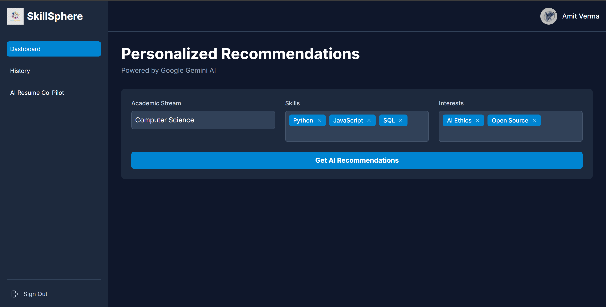
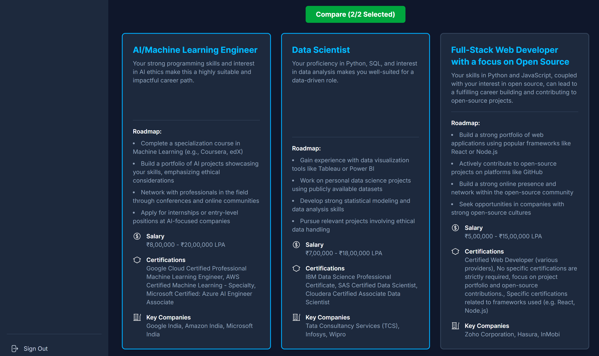

# 🌐 SkillSphere: AI-Powered Career Advisor 
>SkillSphere is a modern, full-stack web application built with Next.js and deployed on Vercel. It is designed to provide personalized career and skill recommendations to users, leveraging the power of Google's Gemini AI to offer tailored advice for their professional journey.
 
 
 

🔗 **Live App**: [https://skill-sphere-7szf.vercel.app](https://skill-sphere-7szf.vercel.app)  

---

## ✨ Key Features  

- 🤖 **AI-Powered Career Recommendations**  
  Generates 3 tailored career paths using Google Gemini 1.5 Flash, based on a user’s academic stream, skills, and interests. Displayed in a clean, card-based UI.  

- ⚖️ **Interactive Career Comparison**  
  Select any two careers and get a side-by-side AI-generated comparison table.  

- 📝 **AI Resume Co-Pilot**  
  Paste a job description, and get customized, powerful resume bullet points based on your skills.  

- 🔐 **Secure User Authentication**  
  Sign in safely with Google accounts via Firebase Authentication.  

- 📱 **Fully Responsive UI**  
  Seamless experience across desktop and mobile devices with Tailwind CSS.  

---

## 🛠️ Tech Stack & Architecture  

| Category         | Technology |
|------------------|------------|
| **Framework**    | Next.js (App Router) |
| **Language**     | TypeScript |
| **Styling**      | Tailwind CSS |
| **Auth**         | Firebase Authentication |
| **Backend**      | Next.js API Routes (Serverless Functions on Vercel) |
| **AI Model**     | Google Gemini 1.5 Flash |
| **Deployment**   | Vercel |

---

## 🚀 Future Scope  

SkillSphere has huge potential to evolve into a **full-fledged career development platform**. Planned enhancements include:  

- 🌐 **Actionable Job & Learning Links**  
  Direct users to relevant job openings or top-rated courses based on their eligibility and skill gaps.  

- 🧩 **AI-Powered Skill Assessment Quizzes**  
  Personalized quizzes to assess skill proficiency and identify knowledge gaps.  

- 📄 **AI Resume Enhancement**  
  Upload full resumes for a comprehensive AI-driven analysis with actionable suggestions for projects and skill upgrades.  

- 🛠️ **AI Project Generator**  
  Generate bespoke portfolio projects aligned with user skills and target careers.  

- 🎤 **AI-Powered Interview Prep**  
  Generate common interview questions for recommended careers with AI-driven feedback on responses.  

- 💬 **Personalized Chatbot**  
  Ask conversational questions about careers, skills, or the job market.  

- 📚 **Hyper-Localized Learning Paths**  
  Integrate Indian educational resources (like NPTEL) and tutorials in regional languages for tailored learning.  
